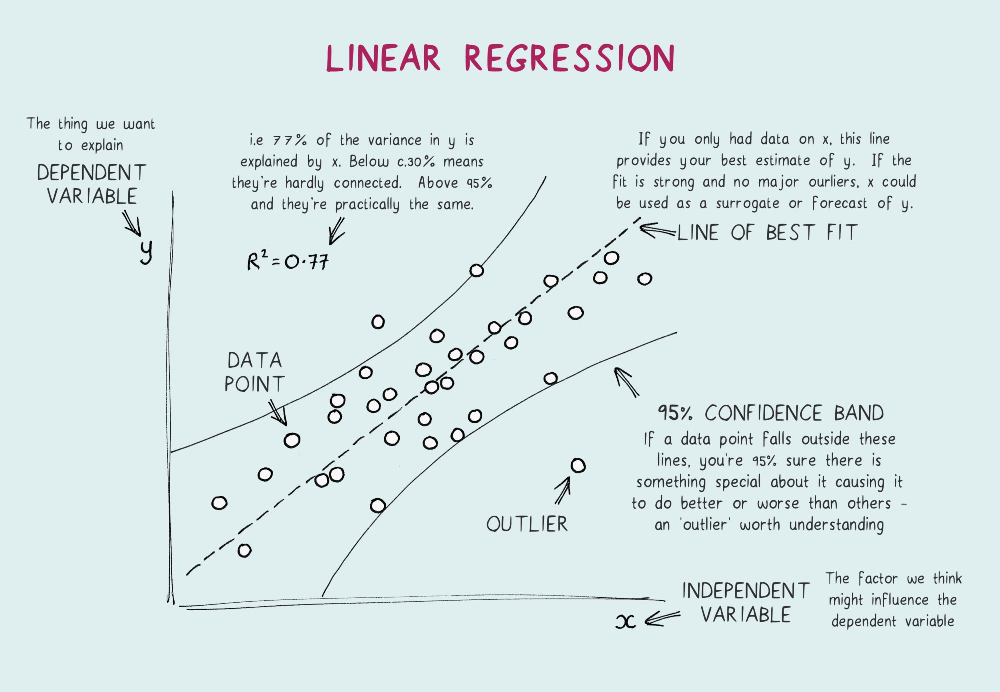

# Correlaciones y regresiones entre el Censo y la Casen

https://towardsdatascience.com/linear-regression-explained-1b36f97b7572\

1. Correlaciones: corre_ing_exp-censo_casen 
2. Regresiones lineales a nivel urbano: reg_ce_ca_2017/urbano
3. Compendio de regresiones urbanas: reg_ce_ca_2017/urbano/reg_lin_censo_casen_compendio.Rmd 
4. Compendio de correlaciones: corre_ing_exp-censo_casen/corr_censo_casen_compendio.html

 

5. Primeras Regresiones lineales: ds_correlaciones_censo_casen/reg_ce_ca_2017

**Primeras regresiones lineales con las más altas correlaciones:**\
6. ds_correlaciones_censo_casen/reg_ce_ca_2017/urbano/analisis_a_nivel_nacional_urbano.Rmd/(producción)
   
**Generación de tablas de correlaciones:**\
7. ds_correlaciones_censo_casen/corre_censo_casen_2017/
    
