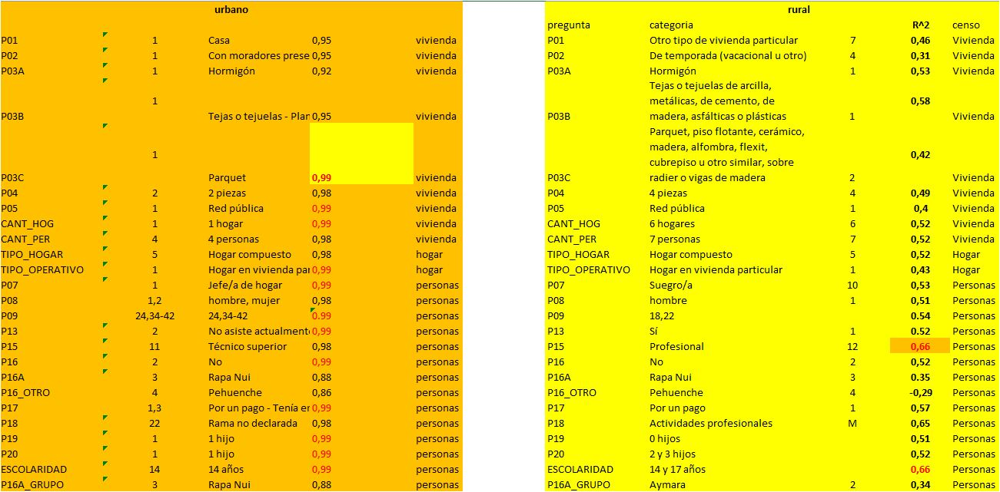

```{r, include=FALSE}
knitr::opts_chunk$set(echo = TRUE)
library(ggplot2)
#library(ggpubr)
library(markdown)
library(shiny)
library(shinythemes)
library(tidyverse)
library(magrittr)
library(lubridate)
#library(plotly)
library(kableExtra)
library(knitr)
library("readxl")
library(writexl)
#library(RPostgreSQL)
#library(devtools)
library(remotes)
library(DBI)
library(tidyverse)
library(kableExtra)
#library(reldist)
library("readxl")
library("writexl")
library(kableExtra)
library(PerformanceAnalytics)
library("rio")
library(ggplot2)
```

## 0 Matriz de correlaciones:




# 1 Censo Vivienda 2017

<hr style="height:3px;border-width:3;color:Grey;background-color:Grey">

## 1.1 **P01**: Tipo de vivienda

1 Casa\
2 Departamento en edificio\
3 Vivienda tradicional indígena (ruka, pae pae u otras) 
4 Pieza en casa antigua o en conventillo 
5 Mediagua, mejora, rancho o choza\
6 Móvil (carpa, casa rodante o similar)\
7 Otro tipo de vivienda particular\
8 Vivienda colectiva\
9 Operativo personas en tránsito (no es vivienda)\
10 Operativo calle (no es vivienda)\

[Correlaciones **P01**](https://rpubs.com/dataintelligence/corr_censo_casen_P01)

### 1.1.1 *Variable que más correlaciona con ingresos expandidos*: 

Urbano: "Casa" (**0,95** Spearman) 

Rural: "Otro tipo de vivienda particular" (**0,46**)

<hr style="height:1px;border-width:3;color:Grey;background-color:Grey">

## 1.2 **P02**: Ocupación de la vivienda

1 Con moradores presentes\
2 Con moradores ausentes\
3 En venta, para arriendo, abandonada u otro\
4 De temporada (vacacional u otro)

[Correlaciones **P02**](https://rpubs.com/dataintelligence/corr_censo_casen_P02)

### 1.2.1 *Variable que más correlaciona con ingresos expandidos*: 

Urbano: "Con moradores presentes" (**0,95** Spearman) 

Rural: "De temporada (vacacional u otro)" (**0,31** Spearman)

<hr style="height:1px;border-width:3;color:Grey;background-color:Grey">

## 1.3 **P03A**: Material de los muros exteriores

1 Hormigón armado\
2 Albañilería: bloque de cemento, piedra o ladrillo\
3 Tabique forrado por ambas caras (madera o acero)\
4 Tabique sin forro interior (madera u otro)\
5 Adobe, barro, quincha, pirca u otro artesanal tradicional\
6 Materiales precarios (lata, cartón, plástico, etc.)\
98 No aplica\
99 Missing

[Correlaciones **P03A**](https://rpubs.com/dataintelligence/corr_censo_casen_P03A)

### 1.3.1 *Variable que más correlaciona con ingresos expandidos*: 

Urbano: "Hormigón" (**0,92** Spearman)

Rural: "Hormigón" (**0,53** Spearman)

<hr style="height:1px;border-width:3;color:Grey;background-color:Grey">


## 1.4 **P03B**: Material en la cubierta del techo

1 Tejas o tejuelas de arcilla, metálicas, de cemento, de madera, asfálticas o plásticas\
2 Losa hormigón\
3 Planchas metálicas de zinc, cobre, etc. o fibrocemento (tipo pizarreño)\
4 Fonolita o plancha de fieltro embreado\
5 Paja, coirón, totora o caña\
6 Materiales precarios (lata, cartón, plásticos, etc.)\
7 Sin cubierta sólida de techo\

[Correlaciones **P03B**](https://rpubs.com/dataintelligence/corr_cc_P03B)

### 1.4.1 *Variable que más correlaciona con ingresos expandidos*: 

Urbano: "Tejas o tejuelas de arcilla, metálicas, de cemento, de madera, asfálticas o plásticas" (**0,95**) 

Urbano: "Planchas metálicas de zinc, cobre, etc. o fibrocemento (tipo pizarreño)" (**0,95** Spearman) 

Rural: "Tejas o tejuelas de arcilla, metálicas, de cemento, de madera, asfálticas o plásticas" (**0,58** Spearman)

<hr style="height:1px;border-width:3;color:Grey;background-color:Grey">

## 1.5 **P03C**: Material de construcción del piso

1 Parquet, piso flotante, cerámico, madera, alfombra, flexit, cubrepiso u otro similar, sobre radier o vigas de madera\
2 Radier sin revestimiento\
3 Baldosa de cemento\
4 Capa de cemento sobre tierra\
5 Tierra\

[Correlaciones **P03C**](https://rpubs.com/dataintelligence/corr_cC_P03C_VR2)


### 1.5.1  *Variable que más correlaciona con ingresos expandidos*: 

Urbano: "Parquet, piso flotante, cerámico, madera, alfombra, flexit, cubrepiso u otro similar, sobre radier o vigas de madera" (**0,99**) 

Rural: "Parquet, piso flotante, cerámico, madera, alfombra, flexit, cubrepiso u otro similar, sobre radier o vigas de madera" (**0,42** Spearman)

<hr style="height:1px;border-width:3;color:Grey;background-color:Grey">


## 1.6 **P04**: Número de piezas usadas exclusivamente como dormitorio

0 piezas\
1 pieza\
2 piezas\
3 piezas\
4 piezas\
5 piezas\
6 o más piezas\

[Correlaciones **P04**](https://rpubs.com/dataintelligence/corr_cc_P04)

### 1.6.1 *Variable que más correlaciona con ingresos expandidos*: 


Urbano: "2 piezas" (**0,98**) 

Rural: "4 piezas" (**0,49** Spearman)

<hr style="height:1px;border-width:3;color:Grey;background-color:Grey">

## 1.7 **P05**: Origen del agua

1 Red pública\
2 Pozo o noria\
3 Camión aljibe\
4 Río, vertiente, estero, canal, lago, etc.\

[Correlaciones **P05**](https://rpubs.com/dataintelligence/corr_cc_P05)

### 1.7.1 *Variable que más correlaciona con ingresos expandidos*:  

Urbano: "Red pública" (**0,99**) 

Rural: "Red pública" (**0,4** Spearman)

<hr style="height:1px;border-width:3;color:Grey;background-color:Grey">

## 1.8 **CANT_HOG**: Cantidad de hogares

[Correlaciones **CANT_HOG**](https://rpubs.com/dataintelligence/corr_cc_CANT_HOG)

### 1.8.1 *Variable que más correlaciona con ingresos expandidos*: 

Urbano: "1 hogar" (**0,99**) 

Rural: "6 hogares" (**0,52** Spearman)

<hr style="height:1px;border-width:3;color:Grey;background-color:Grey">

## 1.9 **CANT_PER**: Cantidad de personas

[Correlaciones **CANT_PER**](https://rpubs.com/dataintelligence/corr_censo_casen_CANT_PER)

### 1.9.1 *Variable que más correlaciona con ingresos expandidos*: 

Urbano: "4 personas" (**0,98**) 

Rural: "7 personas" (**0,52** Spearman)

Ésta correlaciones están lanzadas con Pearson, falta hacerlo con Spearman y Kendall.

<hr style="height:1px;border-width:3;color:Grey;background-color:Grey">


# 2 Censo Hogar 2017

<hr style="height:3px;border-width:3;color:Grey;background-color:Grey">

## 2.1 TIPO_HOGAR 

1 Hogar unipersonal\
2 Hogar nuclear monoparental\
3 Hogar nuclear biparental sin hijos\
4 Hogar nuclear biparental con hijos\
5 Hogar compuesto\
6 Hogar extenso\
7 Hogar sin núcleo\
98 No aplica\
99 Missing\

[Correlaciones **TIPO_HOGAR**](https://rpubs.com/dataintelligence/corr_cc_TIPO_HOGAR)

### 2.1.1 *Variable que más correlaciona con ingresos expandidos*: 

Urbano: "Hogar compuesto" (**0,98**) 

Rural: "Hogar compuesto" (**0,52** Spearman)

<hr style="height:1px;border-width:3;color:Grey;background-color:Grey">


## 2.2 TIPO_OPERATIVO 


1 Hogar en vivienda particular\
8 Vivienda colectiva (no es hogar)\
9 Operativo personas en tránsito (no es hogar)\
10 Operativo calle (no es hogar)\

[Correlaciones **TIPO_OPERATIVO**](https://rpubs.com/dataintelligence/corr_cc_TIPO_OPERATIVO)


### 2.2.1 *Variable que más correlaciona con ingresos expandidos*: 

Urbano: "Hogar en vivienda particular" (**0,99**) 

Rural: Spearman : "Hogar en vivienda particular" (**0,43**)


<hr style="height:1px;border-width:3;color:Grey;background-color:Grey">

# 3 Censo Personas 2017

<hr style="height:3px;border-width:3;color:Grey;background-color:Grey">

## 3.1 **P07**: Relación de parentesco

1 Jefe/a de hogar\
2 Esposo/a o cónyuge\
3 Conviviente por unión civil\
4 Conviviente de hecho o pareja\
5 Hijo/a\
6 Hijo/a del cónyuge, conviviente o pareja\
7 Hermano/a\
8 Padre/madre\
9 Cuñado/a\
10 Suegro/a\
11 Yerno/nuera\
12 Nieto/a\
13 Abuelo/a\
14 Otro pariente\
15 No pariente\
16 Servicio doméstico puertas adentro\
17 Persona en vivienda colectiva\
18 Persona en tránsito\
19 Persona en operativo calle\


[Correlaciones **TIPO_OPERATIVO**](https://rpubs.com/dataintelligence/corr_cec_P07)

### 3.1.1 *Variable que más correlaciona con ingresos expandidos*: 

Urbano: "Jefe/a de hogar" (**0,99**) 

Rural: Spearman : "Suegro/a" (**0,53**)


<hr style="height:1px;border-width:3;color:Grey;background-color:Grey">

## 3.2 **P08**: Sexo

[Correlaciones **P08**](https://rpubs.com/dataintelligence/corr_censo_casen_P08)

### 3.2.1 Variable que más correlaciona a nivel: 

Urbano: "hombre, mujer" (**0,98**) 

Rural: "hombre" (**0,51** Spearman)

<hr style="height:1px;border-width:3;color:Grey;background-color:Grey">

## 3.3 **P09**: Edad

[Correlaciones **P09**](https://rpubs.com/dataintelligence/corr_cc_P09)

### 3.3.1 Variable que más correlaciona a nivel: 

URBANO: 24,34-42(0.99)

RURAL: 18,22(**0.54** Spearman)

<hr style="height:2px;border-width:3;color:Red;background-color:Red">

<span style="color:red">¿Las siguientes variables resultan relevantes a correlacionar?</span>

#### P10: COMUNA: Comuna de residencia habitual\

1 En esta vivienda\
2 En otra vivienda\
3 En otra comuna\
4 En otro país\
98 No Aplica\ 
99 Missing

#### P11: COMUNA: Comuna de residencia hace 5 años\
#### P12: COMUNA: Comuna de nacimiento\

#### P10: PAIS País de residencia habitual\
#### P11: PAIS País de residencia hace 5 años\
#### P12: PAIS País de nacimiento

#### P12A_LLEGADA: Año de llegada al país
#### P12A_TRAMO: Período de llegada al País

<hr style="height:2px;border-width:3;color:Red;background-color:Red">

## 3.4 **P15**: Nivel del curso más alto aprobado

[Correlaciones **P15**](https://rpubs.com/dataintelligence/corr_censo_casen_P15)

### 3.4.1 Variable que más correlaciona a nivel: 

Urbano: "Técnico superior" (**0,98**) 

Rural: "Profesional" (**0,66**)


<span style="color:red">**Se debe hacer un análisis más profundo que correlacione conjuntamente "Nivel del curso más alto aprobado (P15)", Curso o años más alto aprobado (p14) y "Completó el nivel especificado (P15A)"**</span>


## 3.5 **P13**: Asiste actualmente a la educación formal

1 Sí\
2 No asiste actualmente\
3 Nunca asistió\

[Correlaciones **P13**](https://rpubs.com/dataintelligence/corr_cc_P13)

### 3.5.1 *Variable que más correlaciona con ingresos expandidos*: 

Urbano: "No asiste actualmente" (**0,99**) 

Rural: "Sí" (**0.52** Spearman)


<hr style="height:1px;border-width:3;color:Grey;background-color:Grey">


## 3.6 **P16**: Se considera perteneciente a un pueblo indígena u originario 

Se considera perteneciente a un pueblo indígena u originario


1 Sí\
2 No\
98 No aplica\
99 Missing\

[Correlaciones **P16**](https://rpubs.com/dataintelligence/corr_cc_P16)

### 3.6.1 *Variable que más correlaciona con ingresos expandidos*: 

Urbano: "No" (**0,99**) 

Rural: "No" (**0,52** Spearman)


<hr style="height:1px;border-width:3;color:Grey;background-color:Grey">

## 3.7 **P16A**: Pueblo indígena u originario listado

1 Mapuche\
2 Aymara\
3 Rapa Nui\
4 Lican Antai\
5 Quechua\
6 Colla\
7 Diaguita\
8 Kawésqar\
9 Yagán o Yamana\
10 Otro\


[Correlaciones **P16A**](https://rpubs.com/dataintelligence/cor_cc_P16A)


### 3.7.1 *Variable que más correlaciona con ingresos expandidos*: 

Urbano: "Rapa Nui" (**0,88**) 

Rural: Spearman :  "Rapa Nui" (**0.35**)


<hr style="height:1px;border-width:3;color:Grey;background-color:Grey">


<hr style="height:1px;border-width:3;color:Grey;background-color:Grey">

## 3.7 **P16_OTRO**: Pueblo indígena u originario listado

3 Lafquenche\
4 Pehuenche\
5 Huilliche\
6 Picunche\
21 Changos\
22 Chonos\
23 Ona\
28 Tehuelches\
33 Pueblos de América Latina\
34 Pueblos del resto del mundo\
35 Afrodescendiente\
37 Otros pueblos presentes en el territorio nacional\
97 Pueblo no declarado\
98 No aplica\
99 Missing

[Correlaciones **P16A**](https://rpubs.com/dataintelligence/corr_cc_P16A_OTRO)


### 3.7.1 *Variable que más correlaciona con ingresos expandidos*: 

Urbano: "Pehuenche" (**0,86** Spearman) 

Rural: "Pehuenche" (**-0,29**)


<hr style="height:1px;border-width:3;color:Grey;background-color:Grey">


## 3.8 **P17**: Trabajó durante la semana pasada

1 Por un pago en dinero o especies\
2 Sin pago para un familiar\
3 Tenía empleo pero estuvo de vacaciones, con licencia, en descanso laboral, etc.\
4 Se encontraba buscando empleo\
5 Estaba estudiando\
6 Realizó quehaceres de su hogar\
7 Es jubilado, pensionado o rentista\
98 No aplica\
99 Missing

[Correlaciones **P17**](https://rpubs.com/dataintelligence/corr_censo_casen_P17)

### 3.8.1 *Variable que más correlaciona con ingresos expandidos*: 

Urbano: "Por un pago" y "Tenía empleo pero estuvo de vacaciones, con licencia, en descanso laboral, etc." (**0,99**) 

Rural: "Por un pago" (**0,57** Spearman)

<hr style="height:1px;border-width:3;color:Grey;background-color:Grey">


## 3.9 **P18**: Rama de actividad económica

[Correlaciones **P18**](https://rpubs.com/dataintelligence/corr_censo_casen_P18)

### 3.9.1 *Variable que más correlaciona con ingresos expandidos*: 

Urbano: "Rama no declarada" (**0,98**)\

Rural: ""Actividades profesionales"" (**0,65** Spearman)

<hr style="height:1px;border-width:3;color:Grey;background-color:Grey">


## 3.10 **P19**: Total hijos/as nacidos vivos

[Correlaciones **P19**](https://rpubs.com/dataintelligence/corr_cc_P19)

### 3.10.1 *Variable que más correlaciona con ingresos expandidos* 

Urbano: "1 hijo" (**0,99**) 

Rural: "0 hijos" (**0,51** Spearman)

<hr style="height:1px;border-width:3;color:Grey;background-color:Grey">


## 3.17 **P20**: Total hijos/as actualmente vivos

[Correlaciones **P20**](https://rpubs.com/dataintelligence/corr_cc_P20)

### 3.17.1 *Variable que más correlaciona con ingresos expandidos*

Urbano: "1 hijo" (**0,99**) 

Rural: "2 y 3 hijos" (**0,52** Spearman)


<hr style="height:2px;border-width:3;color:Red;background-color:Red">

<span style="color:red">¿Las siguientes variables resultan relevantes a correlacionar?</span>

#### P21M: Mes de nacimiento del último/a hijo/a

#### P21A: Año de nacimiento del último/a hijo/a

#### P10PAIS_GRUPO: País de residencia habitual (grupo)

#### P11PAIS_GRUPO: País de residencia hace 5 años (grupo)

#### P12PAIS_GRUPO: País de nacimiento (grupo)

<hr style="height:2px;border-width:3;color:Red;background-color:Red">


## 3.18 **ESCOLARIDAD**: Años de escolaridad

Ésta pregunta posee 21 categorías de respuesta:

0-21 años

[Correlaciones **ESCOLARIDAD**](https://rpubs.com/dataintelligence/corr_cc_esc)

### 3.18.1 *Variable que más correlaciona con ingresos expandidos*

Urbano: "14 años" (**0,99**) 

Rural: "14 años" (**0,66** Spearman)

Rural: "17 años" (**0,66** Spearman)

<hr style="height:1px;border-width:3;color:Grey;background-color:Grey">


## 3.19 **P16A_GRUPO**: Pueblo indígena u originario (grupo) 

Ésta pregunta posee 10 categorías de respuesta:

1 Mapuche\
2 Aymara\
3 Rapa Nui\
4 Lican Antai\
5 Quechua\
6 Colla\
7 Diaguita\
8 Kawésqar\
9 Yagán o Yamana\
10 Otro pueblo\
98 No aplica\
99 Missing\

[Correlaciones **P16A_GRUPO**](https://rpubs.com/dataintelligence/corr_cc_P16A_GRUPO)


### 3.19.1 *Variable que más correlaciona con ingresos expandidos*

Urbano: "Rapa Nui" (**0,88** Spearman) 

Rural: "Aymara" (**0,34** Spearman)

<hr style="height:5px;border-width:5;color:Grey;background-color:Grey">

https://github.com/rasbt/pattern_classification/blob/master/resources/latex_equations.md#correlation---pearson


